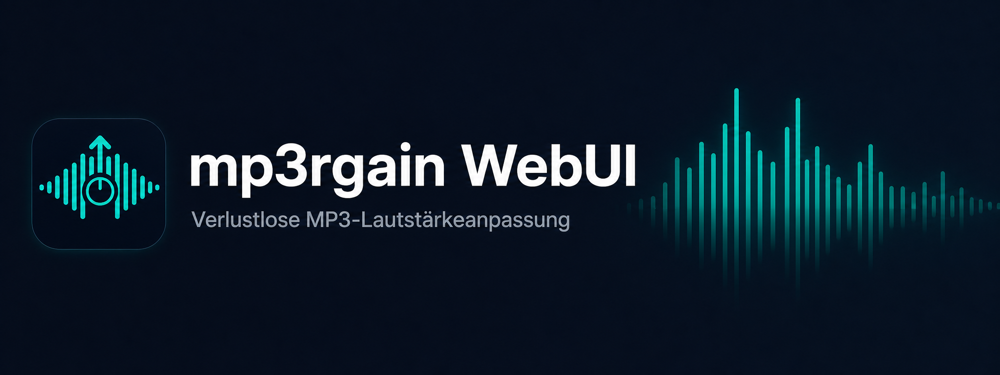
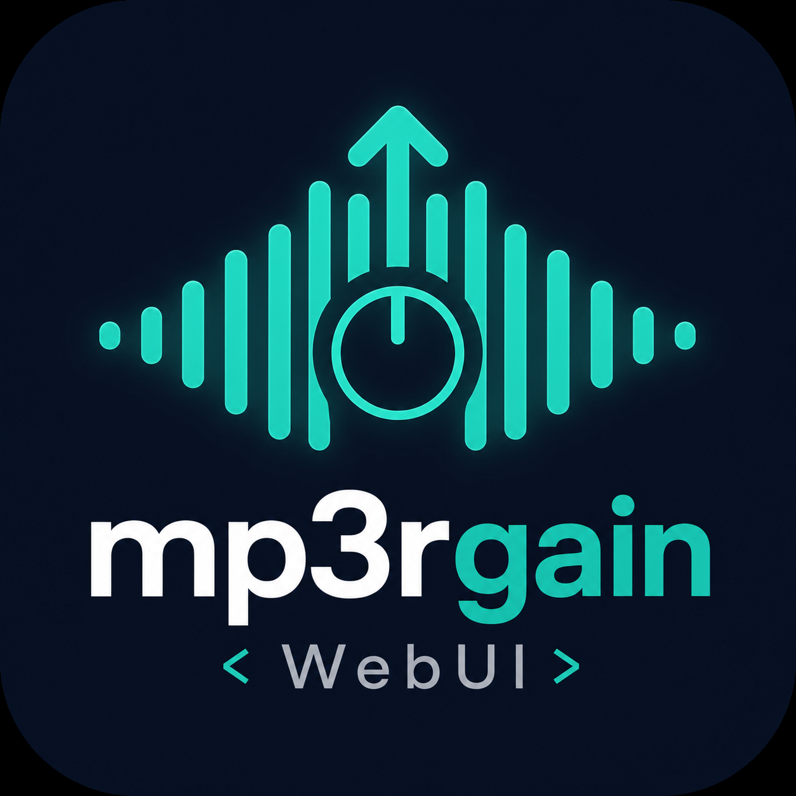

# hAI.mp3rgainDockerWebUI 🎧🟢

<a href="https://www.buymeacoffee.com/highfish">

</a>



<p align="center"></p>


> 🪄 **Verlustfreie** Lautstärke-Normierung für MP3 – als WebUI im Browser, lauffähig als Portainer-Stack mit Docker.

---

## 🎯 Features

- 🖥 **WebUI** (Flask) – Bedienung komplett im Browser
- 📁 **Ordner-Mount** – verarbeitet MP3s aus einem gemounteten Host-Ordner
- 📤 **Datei-Upload** – Mehrere MP3-Dateien direkt im Browser hochladen
- 📦 **Stapelverarbeitung** – ganze Alben oder Ordner in einem Rutsch
- 🎚 **Modi**: Track Gain (`-r`), Album Gain (`-a`), Undo (`-u`)
- 📥 **ZIP-Download** der bearbeiteten Dateien
- 🔒 **Originale bleiben unverändert** – immer Kopie in Job-Arbeitsordner
- 💚 **Verlustfrei** – kein Re-Encoding, nur `global_gain`-Anpassung

---

## 🧩 Architektur

```text
Host
 └─ /opt/mp3rgain/music
     ├─ in/      ← Eingabe (Originale)
     └─ out/     ← Ausgabe (Jobs + ZIPs)

Container
 └─ /music
     ├─ /music/in    ← INPUT_DIR
     └─ /music/out   ← OUTPUT_DIR
```

---

## 🚀 Quickstart (Portainer Stack)

1. Dieses Repository klonen
2. In Portainer neuen **Stack** anlegen
3. Inhalt von `docker-compose.yml` einfügen und Pfade anpassen
4. Stack deployen
5. WebUI öffnen: `http://DEINE-IP:8099`

```yaml
version: "3.8"

services:
  mp3rgain-webui:
    build: https://github.com/jbkunama1/hAI.mp3rgainDockerWebUI.git
    container_name: mp3rgain-webui
    ports:
      - "8099:8099"
    environment:
      - TZ=Europe/Berlin
      - APP_PORT=8099
      - INPUT_DIR=/music/in
      - OUTPUT_DIR=/music/out
      - TEMP_DIR=/tmp/mp3rgain-jobs
      - MAX_CONTENT_LENGTH=2147483648
    volumes:
      - mp3rgain_data:/app/data
      - /opt/mp3rgain/music:/music   # Host-Pfad anpassen!
    restart: unless-stopped
    mem_limit: 256m
    cpus: "1.0"

volumes:
  mp3rgain_data:
```

> 💡 Passe `/opt/mp3rgain/music` auf deinen tatsächlichen Musik-Ordner an.

---

## 🕹 WebUI – Bedienung

### Quelle wählen

- **Gemounteter Eingabeordner** – Basis ist `INPUT_DIR`, optionaler Unterordner möglich, rekursiv alle `.mp3`
- **Upload** – eine oder mehrere `.mp3`-Dateien direkt im Browser hochladen

### Modus wählen

| Modus | Flag | Beschreibung |
|---|---|---|
| Track Gain | `-r` | Normalisiert jede Datei für sich |
| Album Gain | `-a` | Alle Dateien als zusammengehöriges Album |
| Undo | `-u` | Macht frühere Änderungen rückgängig |

### Ergebnis herunterladen

Nach erfolgreichem Job erscheint ein Eintrag in der **Ergebnisse-Tabelle** mit Zeitstempel, Job-ID, Modus und Dateianzahl. Klick auf **„ZIP laden"** lädt alle bearbeiteten Dateien.

---

## ⚙️ Environment-Variablen

| Variable | Default | Beschreibung |
|---|---|---|
| `APP_PORT` | `8099` | HTTP-Port im Container |
| `INPUT_DIR` | `/music/in` | Eingangspfad im Container |
| `OUTPUT_DIR` | `/music/out` | Ausgangspfad im Container |
| `TEMP_DIR` | `/tmp/mp3rgain-jobs` | Temporäre Job-Verzeichnisse |
| `MAX_CONTENT_LENGTH` | `2147483648` | Max. Upload-Größe (~2 GB) |

---

## 🧪 Lokaler Build & Test

```bash
# Ordner anlegen
mkdir -p /opt/mp3rgain/music/in /opt/mp3rgain/music/out

# Build
docker build -t hai-mp3rgain-webui .

# Run
docker run --rm -p 8099:8099 \
  -e TZ=Europe/Berlin \
  -v /opt/mp3rgain/music:/music \
  hai-mp3rgain-webui
```

Danach im Browser: `http://localhost:8099`

---

## 📚 Basis-Tool: mp3rgain

Dieses Projekt nutzt [`mp3rgain`](https://github.com/M-Igashi/mp3rgain) als Kern – ein moderner, verlustfreier Ersatz für das klassische `mp3gain`. Es manipuliert das `global_gain`-Feld der MP3-Frames ohne neu zu encodieren.

---

## 🗂 Repo-Struktur

```
hAI.mp3rgainDockerWebUI/
├── app.py               # Flask WebUI
├── Dockerfile           # Docker Image Definition
├── docker-compose.yml   # Portainer Stack
├── logo_mp3gainUI.png   # App-Logo
├── banner_mp3gain.png   # Banner
├── README.md            # Diese Datei (DE)
└── README_en.md         # English version
```

---

## ⚠️ Disclaimer

- Benutzung auf eigene Gefahr
- Teste zuerst mit Kopien deiner Dateien
- Kein offizielles Projekt des mp3rgain-Autors

---

## 🧩 License

MIT

---

> 📖 English version: [README_en.md](README_en.md)

